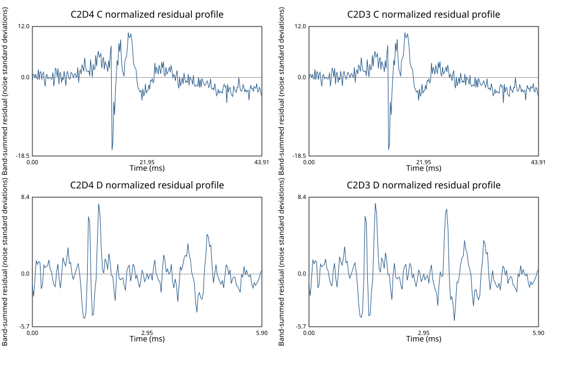

# Deprecated Zach C2D4 failure audit

**Verdict:** reject h17 job 180 as a fit and review candidate. Retain its
artifacts only as failure evidence for the controlled C2D4 rerun.

## Trust boundary

The audit reconstructs the archived fit summary, 36,243 weighted posterior
samples, model grid, and complete standard-output and standard-error logs.
Exact artifact hashes are in
`figure_review/audits/2026-07-22-deprecated-zach-c2d4/audit.json`. Input,
configuration, and post-hoc source hashes are in the adjacent
`provenance.json`.

Job 180 used 400 live points, four workers, two CHIME/FRB components, four
DSA-110 components, and gain-prior variance 100. It is not reproducible: no
sampler seed was recorded; the fit driver was untracked in a dirty checkout;
and source, input, and environment hashes were not bound at run time. No
review manifest binds the deprecated panel to these artifacts. The audit
therefore remains diagnostic-only.

The provenance record gives the h17 archive root for the deprecated bytes and
the exact Faber2026 revision and paths for the tracked C2D3 comparison. The
audit output also records its command, working directory, script hash, and
software environment.

## Reconstructed component failures

Weighted posterior reconstruction exactly reproduces every stored component
arrival and width at the 16th, 50th, and 84th percentiles. Direct model-grid
integration independently supplies each component's modeled fluence fraction.
All six 16th-to-84th-percentile arrival intervals lie inside their fitted time
windows.

The fourth DSA-110 component is not a resolved fourth pulse:

- width: 350.235 ms;
- fitted-window span: 5.89824 ms;
- width/window ratio: 59.380; and
- modeled DSA-110 fluence fraction: 3.0818%.

It is a broad, low-fluence pedestal. The reconstruction also exposes a second
degeneracy: CHIME/FRB component 2 carries only 0.001256% of modeled CHIME/FRB
fluence. A replacement fit must not hide a requested component as either a
broad pedestal or an effectively zero-fluence component.

## Residuals and evidence

The audit reconstructs normalized two-dimensional residual maps and
band-summed residual profiles for C2D4 and the archived C2D3 comparison. It
records their array hashes, extrema, spread, strongest-profile time,
adjacent-bin correlation, and counts above three noise standard deviations.
This preserves residual morphology rather than relying on scalar fit
statistics alone. The stored reduced residual statistics are 2.0252
(CHIME/FRB) and 1.1296 (DSA-110) for C2D4, versus 2.0252 and 1.2126 for C2D3.
The signed profiles remain strongly structured in both fits; C2D4 does not
remove the large CHIME/FRB mismatch and only redistributes DSA-110 residuals.

This SVG is a reproducible diagnostic, not a review candidate.

The C2D3 and C2D4 grids contain identical time/frequency coordinates, data,
noise arrays, and validity masks. Their recorded gain-prior variance and beta
bounds also match. That is insufficient
for a valid evidence comparison: job-time likelihood-source identity and
posterior-mode identity are unproven. The raw difference
`ln Z(C2D4) - ln Z(C2D3) = -10.1023` is recorded only as a diagnostic. It does
not select a component count and is not manuscript evidence.

## Frozen rerun checks

The machine-readable audit requires the controlled rerun to check:

1. every component arrival against fitted support;
2. every component width against the fitted-window span;
3. every component's modeled band-fluence fraction;
4. component structure across fit summary, posterior, and model grid, plus
   full content identity through a hash-bound review manifest;
5. residual-map and residual-profile morphology; and
6. evidence comparisons only after likelihood, prior, support, source, and
   posterior-mode identity are established.

The width and fluence thresholds are diagnostic flags, not automatic
component-count decisions. No deprecated image was admitted to owner review.
