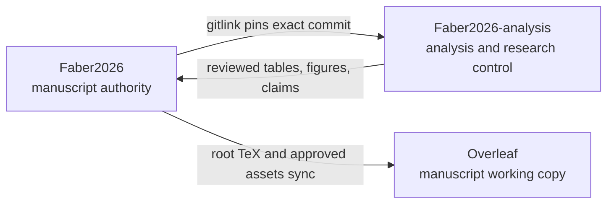
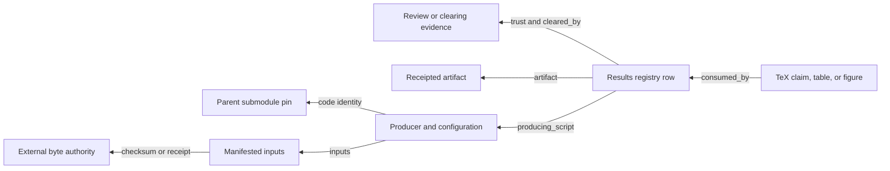

# Faber2026 repository map

Start here to understand where manuscript text, analysis, fitting code, data,
results, and trust decisions live. This is a structural map, not a statement
that every result is currently science-ready. For current trust, consult
[`CONTEXT.md`](../../../CONTEXT.md) and the
[`results registry`](../control/results-registry.toml).

## Ten-minute tour

1. Initialize the pinned analysis repository:

   ```sh
   git submodule update --init --recursive
   git submodule status
   ```

2. Read the repository summaries:
   [manuscript README](../../../../README.md),
   and [analysis README](../../../README.md).
3. Read the [current science and custody context](../../../CONTEXT.md).
4. Find a manuscript-facing product in the
   [results registry](../control/results-registry.toml).
5. Trace figures and tables through
   [`figures/catalog.yaml`](../../../../figures/catalog.yaml) and
   [`repro_manifest.csv`](../../../repro_manifest.csv).
6. Search the project knowledge base before reconstructing history:

   ```sh
   python3 analysis/scripts/kb search "<topic>"
   ```

## One manuscript repository, one pinned analysis repository



### Manuscript parent: `Faber2026/`

Authority for manuscript content committed on GitHub `main`:

- [`main.tex`](../../../../main.tex), [`sections/`](../../../../sections/), and
  [`bib/refs.bib`](../../../../bib/refs.bib): prose and references.
- Root `*_table.tex`: generated or retained manuscript tables.
- [`figures/`](../../../../figures/): approved embedded assets and the
  declarative figure catalog.
- [`.gitmodules`](../../../../.gitmodules): repository locations.
- The `analysis` gitlink: the exact analysis commit paired with the manuscript.

Overleaf can compile this layer without either submodule. It is a working copy,
not a second manuscript authority.

### Analysis submodule: `analysis/`

The public
[`Faber2026-analysis`](https://github.com/jakobtfaber/Faber2026-analysis)
repository owns:

- [`docs/rse/`](../README.md): research control, decisions, protocols,
  certificates, review material, and operational documentation.
- [`docs/analysis/`](../../analysis/): readable scientific diagnostics and
  analysis narratives.
- [`scripts/`](../../../scripts/): manuscript-local analysis, rendering,
  provenance, control, and knowledge-base tools.
- [`tests/`](../../../tests/): scientific, provenance, and state checks.
- [`figure_review/`](../../../figure_review/): fail-closed figure review state.
- Top-level result trees such as
  [`dispersion/results/joint-phase/`](../../../dispersion/results/joint-phase/): small, tracked analysis
  products.
- [`repro_manifest.csv`](../../../repro_manifest.csv): broad output-to-producer
  inventory.

This layer decides what is understood, reviewed, and eligible for manuscript
use. Final TeX and embedded figure bytes remain in the parent.

### Maintained analysis and fitting code

All active scientific code, fitting implementations, workflows, configuration,
and tests live in this repository. The former `dsa110-FLITS` repository is
retired provenance only and must not be imported at runtime. Reusable model code
lives under `faber2026/`; workflow orchestration lives under `workflows/` and
`scripts/`. `pyproject.toml` and `uv.lock` define the complete runtime.

## Scientific data and claim flow

```mermaid
flowchart LR
    rawData["Raw Data"]
    inputProducts["Input Data Products"]
    measurements["Measurements and Fits"]
    analyses["Analyses and Interpretations"]
    claims["In-Manuscript Claims"]

    rawData -->|"calibration, channelization, extraction"| inputProducts
    inputProducts -->|"pinned code, config, environment"| measurements
    measurements -->|"aggregation and physical interpretation"| analyses
    analyses -->|"registry trust and review gates"| claims
```



Each arrow needs evidence. A file existing, a script exiting successfully, or a
plot looking plausible does not establish the next layer.

### Raw and derived inputs

- Raw data on h17 are twelve CHIME/FRB single-beam voltage HDF5 (`.h5`) files
  plus twelve DSA-110 Stokes-I filterbank (`.fil`) files. Intensity and
  upchannelized NumPy products are derived, not raw.
- Input data products (fit inputs) are the 24 derived CHIME/FRB and DSA-110
  intensity cubes on h17. Copies on jakob-mbp under
  `~/Data/Faber2026/chimefrb/CHIME_bursts/` and
  `~/Data/Faber2026/dsa110/DSA_bursts/` are replicas. CANFAR is not the
  fit-input authority.
- Input locations, hashes, and host roles are described by
  [`data/catalog/data-manifest.csv`](../../../data/catalog/data-manifest.csv)
  and
  [`data/catalog/machine_inventory.yaml`](../../../data/catalog/machine_inventory.yaml).
- [`config/bursts.yaml`](../../../config/bursts.yaml) is the canonical burst
  metadata registry.

Dispersion measure values embedded in derived filenames describe those products;
they are not values frozen into the raw voltage archive.

### Measurements, fits, and analyses

Repository-owned model code and subject-local configuration produce fit
artifacts. Focused or dated runs belong in the relevant subject's `studies/`
directory. Current canonical inputs, methods, results, figures, and tests use
the matching subject-level directory.

Bulk campaign bytes do not belong in Git. The local navigable view is
`~/Data/Faber2026/results-library/`, built from
[`results_library_catalog.yaml`](../../../scripts/results_library_catalog.yaml)
by [`materialize_results_library.py`](../../../scripts/materialize_results_library.py).
Its links and replicas aid access; they do not confer authority or scientific
trust.

Tracked object identities settle conflicts for accepted bulk result bytes on
h17 or in the local results library. The
[results registry](../control/results-registry.toml) separately settles which
results are current and trusted for manuscript consumption.

### Manuscript claims

The parent consumes approved tables, figures, and prose claims. Trust is
fail-closed:

- [`results-registry.toml`](../control/results-registry.toml) records each
  manuscript-facing product's producer, inputs, artifact, pin, consumers,
  trust, and clearing evidence.
- [`verification-protocol.md`](../protocols/verification-protocol.md) defines
  checks across the data chain.
- [`figure_review/`](../../../figure_review/) records figure review batches and
  approvals.
- [`program-state.toml`](../control/program-state.toml) and
  [`evidence-ledger.toml`](../control/evidence-ledger.toml) are canonical
  control state; generated views must not be hand-edited.
- [`map-apj-submission.md`](../wayfinder/map-apj-submission.md) and
  [`BOARD.md`](../control/BOARD.md) identify open decisions and execution work.

## Provenance authorities

| Content class | Authority or governing record | Important distinction |
|---|---|---|
| Manuscript text, generated tables, approved figures | Faber2026 GitHub `main` | Overleaf and local clones are working copies |
| Analysis and research-control history | Pinned `Faber2026-analysis` commit | Parent gitlink selects the manuscript pair |
| Fitting code history | `faber2026/`, `workflows/`, `scripts/`, `pyproject.toml`, and `uv.lock` in the pinned analysis commit | Retired FLITS history is provenance only, never runtime authority |
| Raw data | h17: 12 `.h5` + 12 `.fil` | Derived arrays are not raw |
| Fit-input cubes (24) | h17 intensity cubes | jakob-mbp copies are replicas; not CANFAR |
| Accepted bulk result bytes | Tracked h17 or local results-library objects | Byte custody does not imply scientific trust |
| Manuscript-facing scientific trust | `results-registry.toml` plus clearing evidence | A trusted claim may point to bytes outside Git |
| Local results navigation | `~/Data/Faber2026/results-library/` | A view, not an authority |

Authority and current physical location are different questions. Consult
[`CONTEXT.md`](../../../CONTEXT.md) for the precise custody vocabulary and
current assignments.

## Trace a result backward



### Claim or number

1. Find the TeX location in `sections/`.
2. Find the matching `consumed_by` entry in `results-registry.toml`.
3. Check `current`, `trust`, and `cleared_by`; do not infer trust from prose.
4. Follow `producing_script`, `inputs`, `artifact`, `external_sources`, and
   dependency pin.
5. Resolve missing or provisional lineage through the named certificate,
   exception, ticket, or clearing record.

### Figure

1. Find its `\includegraphics` call and output path.
2. Find the output in [`figures/catalog.yaml`](../../../../figures/catalog.yaml)
   for command, working directory, dependencies, inputs, and review policy.
3. Check [`repro_manifest.csv`](../../../repro_manifest.csv) for broader
   producer and clone-execution history.
4. Check `figure_review/` for the owner decision.
5. Check the results registry for scientific trust. Reproducible bytes and an
   approved visual are necessary but do not alone clear the underlying claim.

### Table

1. Find its `\input` call and root `*_table.tex`.
2. Read the generated-file header and locate its structured source.
3. Find its results-registry row and repro-manifest row.
4. Run the named renderer and cross-repository parity check. A generator checked
   only against its own output cannot detect stale upstream inputs.
5. Record the parent and analysis commits and locked environment used by the check.

### Fit or campaign product

1. Identify the campaign artifact and its configuration.
2. Resolve burst identity through `config/bursts.yaml`.
3. Record the analysis commit and locked environment identity.
4. Resolve input hashes through the data manifests and certificates.
5. Apply the mandatory model/fit and diagnostic review gates.
6. Promote the result to manuscript use only through the results registry.

## Find the right entry point

| Goal | Start here |
|---|---|
| Understand the paper | [`main.tex`](../../../../main.tex), then [`sections/`](../../../../sections/) |
| Know what is currently citable | [`analysis/CONTEXT.md`](../../../CONTEXT.md), then [`results-registry.toml`](../control/results-registry.toml) |
| Find current work or open decisions | [Wayfinder map](../wayfinder/map-apj-submission.md), then [`BOARD.md`](../control/BOARD.md) |
| Understand fitting assumptions | [`CONTEXT.md`](../../../CONTEXT.md), then the relevant subject README and `faber2026/` implementation |
| Change model physics | The maintained `faber2026/` implementation, with focused tests and review |
| Regenerate a manuscript figure | [`figures/catalog.yaml`](../../../../figures/catalog.yaml), then [`figure_flow.py`](../../../scripts/figure_flow.py) |
| Trace a table or figure | [`repro_manifest.csv`](../../../repro_manifest.csv) and [`REPRODUCE.md`](../../../REPRODUCE.md) |
| Locate data | [`data/catalog/`](../../../data/catalog/) and the results-library catalog |
| Browse analysis diagnostics | [`analysis/docs/analysis/`](../../analysis/) |
| Search across code, docs, tickets, history, and references | [`knowledge-base.md`](knowledge-base.md) |

## Environments and checks

From the parent:

```sh
make                         # compile manuscript from committed bytes
make test-science            # analysis and cross-repository checks
make figures                 # clone-safe manuscript figure set
make kb-index                # refresh project knowledge base
```

Analysis producers use this repository's lock:

```sh
cd analysis
uv sync
uv run python <producer.py>
```

Analysis producers that require the broader scientific stack use the Conda
environment documented by the producer:

```sh
conda run -n <documented-environment> python analysis/scripts/<producer.py>
```

Use the exact command recorded in the figure catalog or repro manifest when one
exists. Read [`REPRODUCE.md`](../../../REPRODUCE.md) for known external-data
blocks and command/output-path hazards.

## Names used in this workspace

- **CHIME/FRB**: Canadian Hydrogen Intensity Mapping Experiment Fast Radio
  Burst project.
- **DSA-110**: Deep Synoptic Array, 110-antenna instrument.
- **CANFAR**: Canadian Advanced Network for Astronomical Research.
- **HDF5**: Hierarchical Data Format version 5.
- **FLITS**: retired Fitting Likelihoods In Time-Frequency Spectra repository;
  provenance only, never an active import.

## Common wrong turns

- Changes inside the analysis submodule require a commit there and a deliberate
  parent gitlink update.
- Do not restore a runtime dependency on the retired FLITS repository.
- Do not cite a result because its file exists. Check registry trust and
  clearing evidence.
- Do not equate a verified byte copy with scientific approval.
- Do not use `.archive/` as a current science source.
- Do not hand-edit generated state views, generated tables, or promoted figures.
- Do not assume a successful command wrote the declared output; verify the
  output path and receipt.
- Do not use retired FLITS code or infrastructure as a current scientific
  authority. Read the maintained implementation and analysis lock.
- Do not mix CHIME/FRB products into the DSA-110 local data tree.

## Keeping this map current

Update this map when repository boundaries, authority roles, primary entry
points, or provenance mechanisms change. Put volatile campaign status in
`CONTEXT.md`, the results registry, wayfinder, or board instead. After changes:

```sh
make kb-index
python3 analysis/scripts/kb search "repository map provenance"
```
