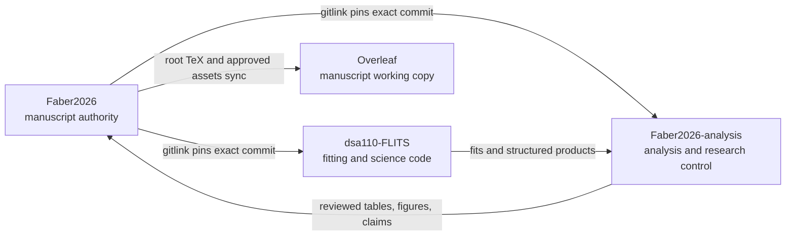
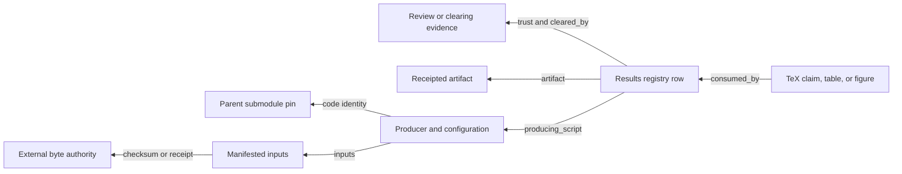

# Faber2026 repository map

Start here to understand where manuscript text, analysis, fitting code, data,
results, and trust decisions live. This is a structural map, not a statement
that every result is currently science-ready. For current trust, consult
[`CONTEXT.md`](../../../CONTEXT.md) and the
[`results registry`](../control/results-registry.toml).

## Ten-minute tour

1. Initialize the two pinned repositories:

   ```sh
   git submodule update --init --recursive
   git submodule status
   ```

2. Read the three repository summaries:
   [manuscript README](../../../../README.md),
   [analysis README](../../../README.md), and
   [pipeline context](../../../../pipeline/CONTEXT.md).
3. Read the [current science and custody context](../../../CONTEXT.md).
4. Find a manuscript-facing product in the
   [results registry](../control/results-registry.toml).
5. Trace figures and tables through
   [`figures/catalog.yaml`](../../../../figures/catalog.yaml) and
   [`repro_manifest.csv`](../../../repro_manifest.csv).
6. Search the project knowledge base before reconstructing history:

   ```sh
   python3 analysis/scripts/kb search "<topic>"
   ```

## Three repositories, one pinned workspace



### Manuscript parent: `Faber2026/`

Authority for manuscript content committed on GitHub `main`:

- [`main.tex`](../../../../main.tex), [`sections/`](../../../../sections/), and
  [`bib/refs.bib`](../../../../bib/refs.bib): prose and references.
- Root `*_table.tex`: generated or retained manuscript tables.
- [`figures/`](../../../../figures/): approved embedded assets and the
  declarative figure catalog.
- [`.gitmodules`](../../../../.gitmodules): repository locations.
- The `analysis` and `pipeline` gitlinks: exact commits paired with the
  manuscript.

Overleaf can compile this layer without either submodule. It is a working copy,
not a second manuscript authority.

### Analysis submodule: `analysis/`

The public
[`Faber2026-analysis`](https://github.com/jakobtfaber/Faber2026-analysis)
repository owns:

- [`docs/rse/`](../README.md): research control, decisions, protocols,
  certificates, review material, and operational documentation.
- [`docs/analysis/`](../../analysis/): readable scientific diagnostics and
  analysis narratives.
- [`scripts/`](../../../scripts/): manuscript-local analysis, rendering,
  provenance, control, and knowledge-base tools.
- [`tests/`](../../../tests/): scientific, provenance, and state checks.
- [`figure_review/`](../../../figure_review/): fail-closed figure review state.
- Top-level result trees such as
  [`dm-joint-phase-v2/`](../../../dm-joint-phase-v2/): small, tracked analysis
  products.
- [`repro_manifest.csv`](../../../repro_manifest.csv): broad output-to-producer
  inventory.

This layer decides what is understood, reviewed, and eligible for manuscript
use. Final TeX and embedded figure bytes remain in the parent.

### Pipeline submodule: `pipeline/`

The
[`dsa110-FLITS`](https://github.com/jakobtfaber/dsa110-FLITS)
repository supplies shared fitting and science code:

- [`scattering/scat_analysis/`](../../../../pipeline/scattering/scat_analysis/):
  canonical scattering physics and joint fitting.
- [`scintillation/scint_analysis/`](../../../../pipeline/scintillation/scint_analysis/):
  autocorrelation and scintillation analysis.
- [`flits/`](../../../../pipeline/flits/): package wrappers, batch execution,
  diagnostics, and result storage.
- [`galaxies/foreground/`](../../../../pipeline/galaxies/foreground/):
  foreground census and dispersion/scattering budgets.
- [`crossmatching/`](../../../../pipeline/crossmatching/) and
  [`dispersion/`](../../../../pipeline/dispersion/): timing association and
  dispersion-measure workflows.
- [`simulation/`](../../../../pipeline/simulation/): known-truth simulations.
- [`analysis/`](../../../../pipeline/analysis/): dated campaigns and their
  compact tracked outputs; not the shared physics kernel.
- [`docs/adr/`](../../../../pipeline/docs/adr/): architecture decision records.

FLITS means *Fitting Likelihoods In Time-Frequency Spectra*. Development
authority is the fork's accepted history; manuscript provenance uses the
parent's pinned gitlink, which may deliberately lag or differ from the fork's
current `main`.

## Scientific data and claim flow

```mermaid
flowchart LR
    rawData["Raw Data"]
    inputProducts["Input Data Products"]
    measurements["Measurements and Fits"]
    analyses["Analyses and Interpretations"]
    claims["In-Manuscript Claims"]

    rawData -->|"calibration, channelization, extraction"| inputProducts
    inputProducts -->|"pinned code, config, environment"| measurements
    measurements -->|"aggregation and physical interpretation"| analyses
    analyses -->|"registry trust and review gates"| claims
```



Each arrow needs evidence. A file existing, a script exiting successfully, or a
plot looking plausible does not establish the next layer.

### Raw and derived inputs

- Raw CHIME/FRB data for this project are the twelve single-beam voltage HDF5
  files on h17. Intensity and upchannelized NumPy products are derived.
- The fit-input authority is the checksum-manifested set of 24 derived
  CHIME/FRB and DSA-110 intensity cubes in CANFAR VOSpace.
- Local fit copies live under
  `~/Data/Faber2026/chimefrb/CHIME_bursts/` and
  `~/Data/Faber2026/dsa110/DSA_bursts/`. They are replicas.
- Pipeline input locations, hashes, and host roles are described by
  [`DATA_LOCATIONS.md`](../../../../pipeline/DATA_LOCATIONS.md),
  [`DATA_SOURCES.md`](../../../../pipeline/DATA_SOURCES.md),
  [`data-manifest.csv`](../../../../pipeline/data-manifest.csv),
  [`codetections_manifest.yaml`](../../../../pipeline/codetections_manifest.yaml),
  and [`machine_inventory.yaml`](../../../../pipeline/machine_inventory.yaml).
- [`configs/bursts.yaml`](../../../../pipeline/configs/bursts.yaml) is the
  canonical burst metadata registry used by the pipeline.

Dispersion measure values embedded in derived filenames describe those products;
they are not values frozen into the raw voltage archive.

### Measurements, fits, and analyses

Pipeline code and per-run configuration produce fit artifacts. Dated campaign
drivers belong under [`pipeline/analysis/`](../../../../pipeline/analysis/);
small manuscript-local transformations and diagnostic products belong in
`analysis/`.

Bulk campaign bytes do not belong in Git. The local navigable view is
`~/Data/Faber2026/results-library/`, built from
[`results_library_catalog.yaml`](../../../scripts/results_library_catalog.yaml)
by [`materialize_results_library.py`](../../../scripts/materialize_results_library.py).
Its links and replicas aid access; they do not confer authority or scientific
trust.

The exact receipted Google Drive scope settles conflicts for accepted bulk
result bytes. The [results registry](../control/results-registry.toml) separately
settles which results are current and trusted for manuscript consumption.

### Manuscript claims

The parent consumes approved tables, figures, and prose claims. Trust is
fail-closed:

- [`results-registry.toml`](../control/results-registry.toml) records each
  manuscript-facing product's producer, inputs, artifact, pin, consumers,
  trust, and clearing evidence.
- [`verification-protocol.md`](../protocols/verification-protocol.md) defines
  checks across the data chain.
- [`figure_review/`](../../../figure_review/) records figure review batches and
  approvals.
- [`program-state.toml`](../control/program-state.toml) and
  [`evidence-ledger.toml`](../control/evidence-ledger.toml) are canonical
  control state; generated views must not be hand-edited.
- [`map-apj-submission.md`](../wayfinder/map-apj-submission.md) and
  [`BOARD.md`](../control/BOARD.md) identify open decisions and execution work.

## Provenance authorities

| Content class | Authority or governing record | Important distinction |
|---|---|---|
| Manuscript text, generated tables, approved figures | Faber2026 GitHub `main` | Overleaf and local clones are working copies |
| Analysis and research-control history | Pinned `Faber2026-analysis` commit | Parent gitlink selects the manuscript pair |
| Fitting code history | Accepted `jakobtfaber/dsa110-FLITS` history | Parent pipeline gitlink selects the code actually paired with the manuscript |
| Raw CHIME/FRB voltage archive | h17 scope named in project provenance | Derived arrays are not raw |
| Fit-input cubes | Checksum-manifested CANFAR VOSpace set | Mac files are replicas |
| Accepted bulk result bytes | Receipted Google Drive result-object scope | Byte authority does not imply scientific trust |
| Manuscript-facing scientific trust | `results-registry.toml` plus clearing evidence | A trusted claim may point to bytes outside Git |
| Local results navigation | `~/Data/Faber2026/results-library/` | A view, not an authority |

Authority and current physical location are different questions. Consult
[`CONTEXT.md`](../../../CONTEXT.md) for the precise custody vocabulary and
current assignments.

## Trace a result backward



### Claim or number

1. Find the TeX location in `sections/`.
2. Find the matching `consumed_by` entry in `results-registry.toml`.
3. Check `current`, `trust`, and `cleared_by`; do not infer trust from prose.
4. Follow `producing_script`, `inputs`, `artifact`, `external_sources`, and
   `pipeline_pin`.
5. Resolve missing or provisional lineage through the named certificate,
   exception, ticket, or clearing record.

### Figure

1. Find its `\includegraphics` call and output path.
2. Find the output in [`figures/catalog.yaml`](../../../../figures/catalog.yaml)
   for command, working directory, dependencies, inputs, and review policy.
3. Check [`repro_manifest.csv`](../../../repro_manifest.csv) for broader
   producer and clone-execution history.
4. Check `figure_review/` for the owner decision.
5. Check the results registry for scientific trust. Reproducible bytes and an
   approved visual are necessary but do not alone clear the underlying claim.

### Table

1. Find its `\input` call and root `*_table.tex`.
2. Read the generated-file header and locate its structured source.
3. Find its results-registry row and repro-manifest row.
4. Run the named renderer and cross-repository parity check. A generator checked
   only against its own output cannot detect stale upstream inputs.
5. Record both the parent commit and any pipeline pin used by the check.

### Fit or campaign product

1. Identify the campaign artifact and its configuration.
2. Resolve burst identity through `pipeline/configs/bursts.yaml`.
3. Record the parent pipeline gitlink, not merely the pipeline branch tip.
4. Resolve input hashes through the data manifests and certificates.
5. Apply the mandatory model/fit and diagnostic review gates.
6. Promote the result to manuscript use only through the results registry.

## Find the right entry point

| Goal | Start here |
|---|---|
| Understand the paper | [`main.tex`](../../../../main.tex), then [`sections/`](../../../../sections/) |
| Know what is currently citable | [`analysis/CONTEXT.md`](../../../CONTEXT.md), then [`results-registry.toml`](../control/results-registry.toml) |
| Find current work or open decisions | [Wayfinder map](../wayfinder/map-apj-submission.md), then [`BOARD.md`](../control/BOARD.md) |
| Understand fitting assumptions | [`pipeline/CONTEXT.md`](../../../../pipeline/CONTEXT.md), then [`pipeline/docs/adr/`](../../../../pipeline/docs/adr/) |
| Change model physics | [`burstfit.py`](../../../../pipeline/scattering/scat_analysis/burstfit.py) |
| Regenerate a manuscript figure | [`figures/catalog.yaml`](../../../../figures/catalog.yaml), then [`figure_flow.py`](../../../scripts/figure_flow.py) |
| Trace a table or figure | [`repro_manifest.csv`](../../../repro_manifest.csv) and [`REPRODUCE.md`](../../../REPRODUCE.md) |
| Locate data | [`pipeline/DATA_LOCATIONS.md`](../../../../pipeline/DATA_LOCATIONS.md) and the results-library catalog |
| Browse analysis diagnostics | [`analysis/docs/analysis/`](../../analysis/) |
| Search across code, docs, tickets, history, and references | [`knowledge-base.md`](knowledge-base.md) |

## Environments and checks

From the parent:

```sh
make                         # compile manuscript from committed bytes
make test-science            # analysis and cross-repository checks
make figures                 # clone-safe manuscript figure set
make kb-index                # refresh project knowledge base
```

Pipeline producers use the lock in `pipeline/uv.lock`:

```sh
cd pipeline
uv sync
uv run python <producer.py>
```

Analysis producers that require the broader scientific stack use the Conda
environment specified by `pipeline/environment.yml`:

```sh
conda env create -f pipeline/environment.yml
conda run -n flits python analysis/scripts/<producer.py>
```

Use the exact command recorded in the figure catalog or repro manifest when one
exists. Read [`REPRODUCE.md`](../../../REPRODUCE.md) for known external-data
blocks and command/output-path hazards.

## Names used in this workspace

- **CHIME/FRB**: Canadian Hydrogen Intensity Mapping Experiment Fast Radio
  Burst project.
- **DSA-110**: Deep Synoptic Array, 110-antenna instrument.
- **CANFAR**: Canadian Advanced Network for Astronomical Research.
- **HDF5**: Hierarchical Data Format version 5.
- **FLITS**: Fitting Likelihoods In Time-Frequency Spectra.

## Common wrong turns

- Do not treat the repository as a monolith. Changes inside either submodule
  require a commit there and a deliberate parent gitlink update.
- Do not bump `pipeline/` as a side effect of a manuscript or analysis edit.
- Do not cite a result because its file exists. Check registry trust and
  clearing evidence.
- Do not equate a verified byte copy with scientific approval.
- Do not use `.archive/` as a current science source.
- Do not hand-edit generated state views, generated tables, or promoted figures.
- Do not assume a successful command wrote the declared output; verify the
  output path and receipt.
- Do not assume the current pipeline branch is the manuscript pipeline. Read the
  parent gitlink.
- Do not mix CHIME/FRB products into the DSA-110 local data tree.

## Keeping this map current

Update this map when repository boundaries, authority roles, primary entry
points, or provenance mechanisms change. Put volatile campaign status in
`CONTEXT.md`, the results registry, wayfinder, or board instead. After changes:

```sh
make kb-index
python3 analysis/scripts/kb search "repository map provenance"
```
