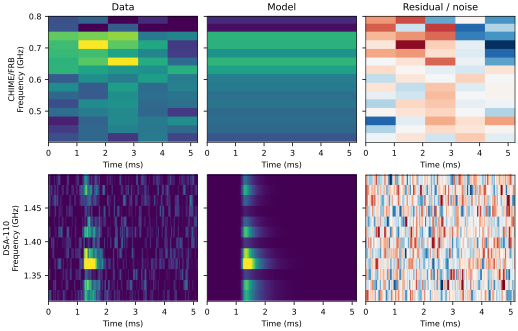
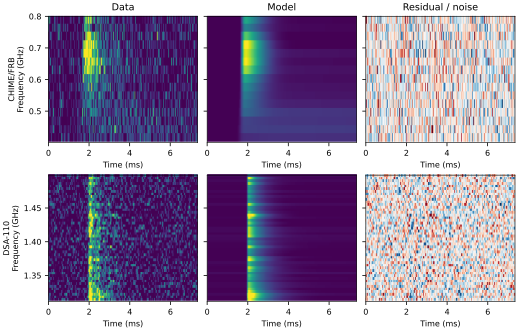
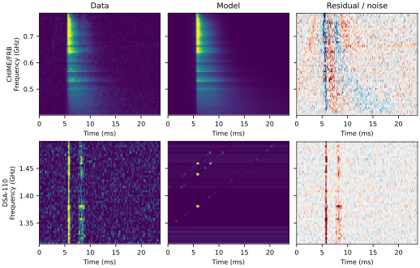

# Controlled joint-scattering v4 owner review

Status: owner scientific and visual decision pending. No panel is approved,
review-admitted, or manuscript-eligible.

All three v4 panels reproduce exactly and are bound to complete controlled-run
receipts. Full-size inspection nevertheless finds scientific-readiness defects
in every model family. The smallest safe owner decision is therefore one
three-panel packet, with **revise** recommended for all three.

## Decisions

### Oran — C1D1

- Exact panel SHA-256: `01bbe8cdcd15cd47c1d02b5901f43bb7e451f728e5f37e04c5a61b7828a0f5ce`
- h17 source: `/home/ubuntu/flits-controlled/joint-scattering-2026-07-23-v4/oran/data/joint/oran_joint_panel_C1D1_s2-100.svg`
- Recommendation: **revise**
- Reason: prior-edge diagnostic rejects the model family; the CHIME/FRB crop
  has only five time bins, the component-width/window guard fires, and coherent
  residual structure remains. Reproduction does not make that morphology
  scientifically adequate.

Owner choice: **approve for independent review** / **revise**

### JohnDoeII — C2D2

- Exact panel SHA-256: `d4e0f432486f3de8fae21d1494478f16b6e15fd54ae13744630ab729e046f7a9`
- h17 source: `/home/ubuntu/flits-controlled/joint-scattering-2026-07-23-v4/johndoeII/data/joint/johndoeII_joint_panel_C2D2_s2-100.svg`
- Recommendation: **revise**
- Reason: prior-edge diagnostic rejects the model family; the component guard
  flags a negligible CHIME/FRB component and a DSA-110 component far broader
  than the fitted window. The DSA-110 residual profile also retains repeated
  excursions. The visually quieter map is not enough to clear these guards.

Owner choice: **approve for independent review** / **revise**

### Zach — C2D4

- Exact panel SHA-256: `345fe7d01fd3b5bd350180d1cc3c0bcc3a85ee1d57550b674c2787604c21261f`
- h17 source: `/home/ubuntu/flits-controlled/joint-scattering-2026-07-23-v4/zach/data/joint/zach_joint_panel_C2D4_s2-100.svg`
- Recommendation: **revise**
- Reason: prior-edge diagnostic rejects the model family; component-width and
  low-fluence guards fire; strong time-localized residual structure is plainly
  visible in both bands. This is not ready for scientific or visual admission.

Owner choice: **approve for independent review** / **revise**

## Boundaries

These recommendations use morphology, window/crop, residual, prior-edge, and
component-count diagnostics only. No fitted parameter is accepted as a
measurement. Choosing “approve for independent review” would admit only the
exact SVG and its receipt-bound diagnostic bundle to a later review step; it
would not approve a figure, trust a value, or enable manuscript promotion.

Machine-readable paths, hashes, recommendations, and unset owner decisions are
in [`decision-packet.json`](decision-packet.json).
